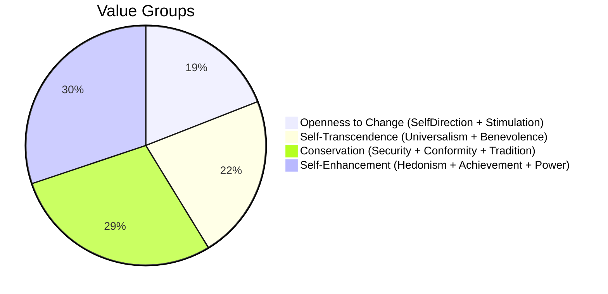

# Personal Values / Core Values Assessment

This project provides a lightweight, efficient web application built with **Svelte** and **Vite** to deliver a fast and smooth Personal Values / Core Values Assessment experience. The tool helps users identify, prioritize, and reflect on their core personal values through an intuitive interface.

The assessment model is based on an **extended and humanized adaptation of Schwartz's Theory of Basic Human Values**, which classifies core values into 10 universal categories that guide human motivation. We've expanded the model to be more accessible and emotionally resonant, particularly for coaching, self-discovery, and leadership development contexts.

## Key Features

- Identify and prioritize your top personal values through a guided interface
- Understand the tensions and balances between value groups (e.g., Openness vs. Conservation)
- Reflect on how your values align with your current goals, relationships, and leadership style
- Designed for individual users, teams, and coaches alike

## Applications

- Self-awareness and personal development
- Leadership training and alignment
- Values-based decision-making
- Coaching and facilitation tools
- Team values mapping and cultural fit analysis

## Values, Value Types and Value Groups



> This is a simplified circular layout of the four higher-order Schwartz value groups, showing the proportion of values each group holds in the 63-value model.


<details>
<summary>Structure of the value system used in the assessment</summary>

This is an extended Schwartz value system used in the Personal Values Assessment. Values are grouped under 10 value types, which in turn are nested within 4 higher-order motivational groups. The connections suggest psychological tensions and alignments.

```mermaid
graph TB

%% Higher-Order Value Groups
subgraph OpennessToChange
  SelfDirection
  Stimulation
end

subgraph SelfTranscendence
  Universalism
  Benevolence
end

subgraph Conservation
  Security
  Conformity
  Tradition
end

subgraph SelfEnhancement
  Hedonism
  Achievement
  Power
end

%% Connect to show psychological tensions (optional)
SelfDirection -- contrast --> Conformity
Stimulation -- contrast --> Security
Universalism -- contrast --> Power
Benevolence -- contrast --> Achievement

%% Value Types to Values (sampled for brevity)
SelfDirection --> curiosity
SelfDirection --> creativity
SelfDirection --> freedom
SelfDirection --> independence
SelfDirection --> self-expression

Stimulation --> excitement
Stimulation --> adventure
Stimulation --> novelty
Stimulation --> energy
Stimulation --> challenge

Achievement --> achievement
Achievement --> ambition
Achievement --> competence
Achievement --> success
Achievement --> recognition

Power --> influence
Power --> status
Power --> control
Power --> dominance
Power --> wealth

Hedonism --> pleasure
Hedonism --> sensuality
Hedonism --> enjoyment
Hedonism --> gratification
Hedonism --> fun

Security --> safety
Security --> protection
Security --> predictability
Security --> personal_security
Security --> resilience

Conformity --> order
Conformity --> obedience
Conformity --> self_control
Conformity --> responsibility
Conformity --> loyalty

Tradition --> humility
Tradition --> cultural_heritage
Tradition --> respect_for_customs
Tradition --> ritual
Tradition --> respect_for_elders

Benevolence --> kindness
Benevolence --> empathy
Benevolence --> helpfulness
Benevolence --> generosity
Benevolence --> community

Universalism --> justice
Universalism --> equality
Universalism --> sustainability
Universalism --> compassion
Universalism --> openness

%% Extra (uncategorized or bridge values)
SelfDirection --> exploration
Benevolence --> belonging
Authenticity[authenticity] --> SelfDirection
Faith[faith] --> Tradition
Leadership[leadership] --> Achievement
```



</details>

---

## Tech Stack

- **Svelte** – Reactive UI framework for building highly performant web apps
- **Vite** – Next-generation frontend tooling for fast development experience

This combination ensures rapid load times, seamless updates, and a responsive user experience.

---

## Getting Started

### Prerequisites
- Node.js (v20+ recommended)

### Installation

1. Clone the repository:
   ```bash
   git clone https://github.com/SerzN1/personal-values.git
   cd personal-values
   ```

2. Install dependencies:
   ```bash
   npm install
   ```

3. Start the development server:
   ```bash
   npm run dev
   ```

   Open [http://localhost:5173](http://localhost:5173) to view the app.
